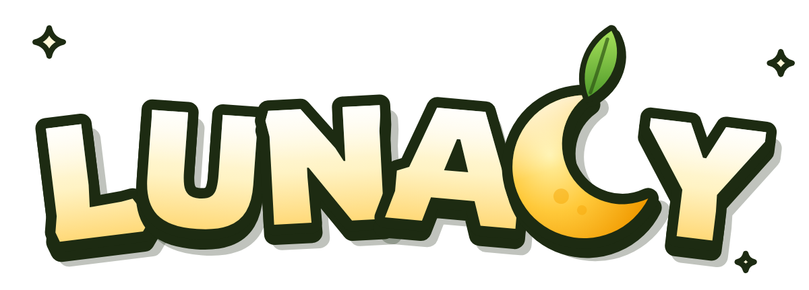

<p align="center"></p>

# Lunacy

**Six Axies. One field. Last one standing.**

A browser arena brawler for **Axie Vibeathon 2026** (theme: Axie Core).

Six Axie classes, each with its own basic attack and special, fighting over a
Lunacia meadow. Named for Lunacia, minus a letter.

Where it goes next (an always-on arena, and how stakes could work without
repeating play-to-earn's mistakes): **[docs/VISION.md](docs/VISION.md)**.
How the combat numbers were chosen: [docs/DESIGN.md](docs/DESIGN.md).

## Run it

```bash
npm install
npm run dev      # http://localhost:5173
npm run build    # static build in dist/
```

## Checks

```bash
node scripts/headless/check-flow.mjs      # full loop in headless Chromium (dev server running)
node scripts/headless/check-parry.mjs     # 17 parry rules, in real matches
node scripts/headless/check-boons.mjs     # 22 power-up and Moonwell rules
node scripts/headless/check-wilds.mjs     # 33 Endless Wilds rules, incl. a 4-minute value-conservation run
node scripts/headless/check-tutorial.mjs  # plays all ten tutorial steps through the real mechanics
node scripts/check-terrain.mjs            # no fake passages, all floor connected (no browser needed)
node scripts/vendor-origins-vfx.mjs       # re-vendor Origins effect plates, icons and sounds
node scripts/brand/build-logo.mjs         # rebuild the logo SVG and PNG exports
node scripts/economy/model.mjs            # stake-mode economy model used in docs/VISION.md
# balance: open http://localhost:5173/?sim=120 in a browser
```

## Modes

- **Tutorial**: ten short playable steps: move, attack, dash, special, parry
  (with a timing ring), power-ups, Moonwells, bushes, a real fight, and a Moon
  Gate. You cannot go down, `Tab` skips a step, and the home screen offers it
  until it has been finished once.
- **Showdown**: six Axies, one closing field, last one standing.
- **The Endless Wilds** *(prototype)*: a room that never ends. Pick a room in
  the lobby and you are in, with no queue. Your stake buys a bounty (a 10% fee
  is taken). A kill takes the victim's whole bounty. Stand in a Moon Gate for
  3s to cash out. Hunters arrive and leave, gates move, and Blood Moons pull
  everyone together. Balances are **simulated practice money with no real
  value**, and every other hunter is an AI stand-in, marked as such. The design
  and economics behind it are in [docs/VISION.md](docs/VISION.md).

## Controls

| Input | Action |
| --- | --- |
| `W` `A` `S` `D` | Move |
| Mouse | Aim |
| Left click | Basic attack |
| Right click / `E` | Special (once charged) |
| `Q` / `F` | Parry — 200ms, front only; a whiff leaves you open |
| `Space` / `Shift` | Dash |
| Walk over an orb | Power-up: Fury, Bulwark, Tailwind or Moonrise |
| Stand in a Moonwell | Heal 8%/s; a rival's hit pauses it |
| Stand in a Moon Gate *(Wilds)* | Cash out your bounty after 3s; a hit or your own attack restarts it |
| `Esc` *(Wilds)* | Leave; without a gate your bounty drops for others |
| `Enter` *(Wilds, after a fall)* | Re-enter the same room |

## Where things are

```
src/
  main.js               Phaser bootstrap
  scenes/BootScene.js   builds the Axies, loads their textures
  scenes/GameScene.js   arena, input, the update loop
  scenes/UIScene.js     HUD, isolated from camera zoom and shake
  entities/Fighter.js   one combatant; player and bots share it
  ai/BotBrain.js        wander → chase → strike → backoff
  arena/PowerUps.js     orbs: Fury, Bulwark, Tailwind, Moonrise
  arena/Moonwell.js     healing wells that bloom mid-match
  scenes/LobbyScene.js  Endless Wilds lobby: live rooms, practice wallet
  tutorial/             the guided course: steps, training partners, coach card
  arena/layout.js       walls and bushes as data, verified by check-terrain
  arena/Foliage.js      Axie-style bushes and hedges, painted with Canvas 2D
  wilds/WildsDirector.js a never-ending room: arrivals, bounties, gates, Blood Moons, ledger
  wilds/MoonGate.js     extraction gates
  wilds/WildsHud.js     bounty, gate compass, top bounties, feed, panels
  wilds/Wallet.js       simulated practice balance, kept in this browser only
  axie/AxieFactory.js   mixer setup and layer export
  axie/AxieSprite.js    assembles and animates the layers
  fx/Juice.js           impact, dust, motes, damage numbers, hit-stop
```

**`AxieSprite` is the seam.** Gameplay never draws anything itself — it calls
`setPosition`, `setFacing`, `update`, `flash`, `playAttack`.

## Rendering approach: real Axie art and animation, no Spine runtime

Axie bodies come from `@axieinfinity/mixer`, which outputs Spine skeleton data
with all 46 authored clips embedded. Playing that normally means shipping
`pixi-spine` — Spine runtime code, which Vibeathon Official Rules §5 says needs
a separate licence from Esoteric Software.

Instead, `src/axie/AxieRig.js` reads the animation data directly and poses each
body part every frame. It supports exactly what these skeletons use, measured
across all 46 clips: region attachments; rotate, translate and scale timelines
with linear, stepped or bezier easing; face swaps; the `normal`, `noScale` and
`noRotationOrReflection` transform modes; and single-bone leg IK.

It is verified against the mixer: at rest, every part lands exactly where
`exportAvatarLayers` puts it with IK disabled, and within one screen pixel with
IK on (the flat export ignores IK; a real render applies it).

38 of the 46 clips carry motion. Each class uses its own:

| Class | Basic | Special |
| --- | --- | --- |
| Beast | horn-gore | sprint into horn-gore |
| Aquatic | tail-multi-slap | tail-thrash |
| Plant | mouth-bite | cast-high |
| Bird | normal-attack | cast-multi |
| Bug | multi-attack | shrimp (somersault) |
| Reptile | tail-smash | tail-roll |

Shared: idle with random flourishes, run (cadence follows speed), a hit
reaction, dash hop, dizzy stun, wind-up during a special's telegraph, entrance,
victory flip. Attack clips are sped up so their impact lands at 165ms, the hit
timing the combat was balanced on.

The three `hit-by-normal` clips are empty in mixed skeletons; hits use
`hit-by-ranged-attack`, the one hit clip with motion.

Skill effects are the real Origins plates, processed by
`scripts/vendor-origins-vfx.mjs` (see DISCLOSURES.md).

## Status

**The core loop is complete**: choose an Axie, fight, win or lose, play again.

Working: home page and class select, a Lunacia field with cover, foliage and a
minimap, real Axie bodies playing their authored clips, six distinct kits,
Origins skill effects and battle audio, parry, power-ups, Moonwells, a closing
field, bots that use all of it, hit-stop, HUD, win and lose, restart. Balance is
checked by simulation and every rule by headless browser tests.

Not yet: mobile controls, networked play (see docs/VISION.md).

## Known issues

- Axie textures load from the official CDN at runtime, so first load needs a
  connection and currently takes several seconds. If the CDN cannot be reached
  the boot screen says so rather than hanging.
- Desktop only so far: no touch controls.
- Audio needs a click before a browser will allow it; the class-select screen
  provides that, so the first match is never silent.

## Disclosures

See [DISCLOSURES.md](./DISCLOSURES.md).
